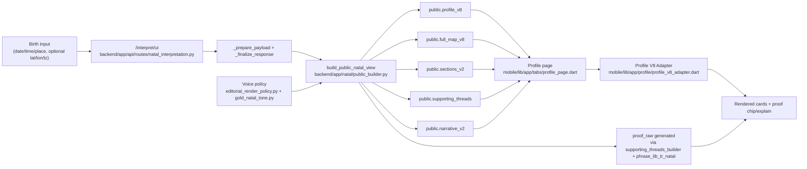
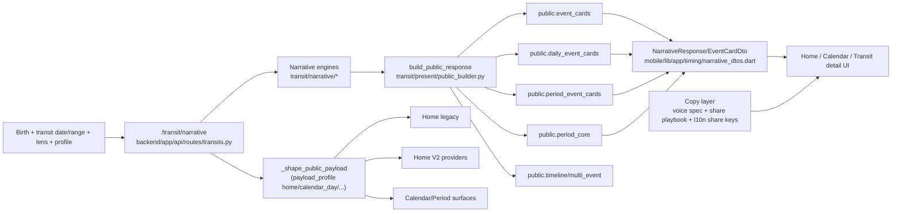
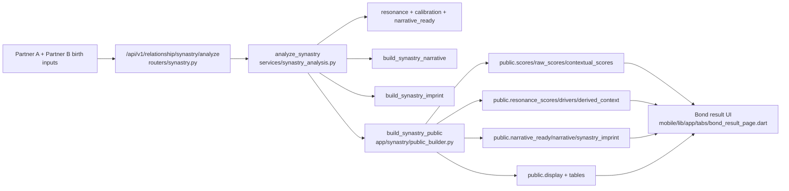
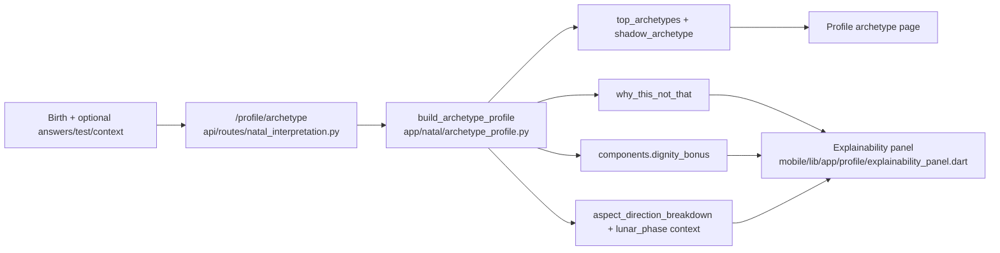
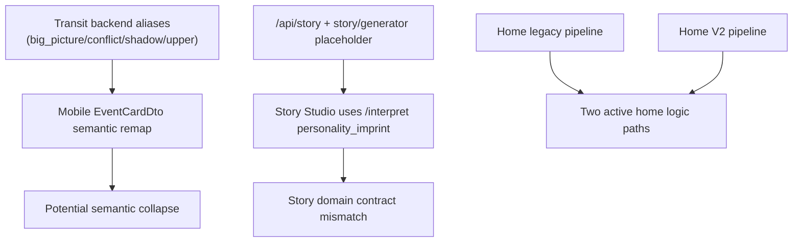

# Canonical Output Graph

## 1) Natal graph

```mermaid
flowchart LR
  A["Birth Input\n(date/time/place, optional lat/lon/tz)"] --> B["/interpret/ui\nbackend/app/api/routes/natal_interpretation.py"]
  B --> C["_prepare_payload + _finalize_response"]
  C --> D["build_public_natal_view\nbackend/app/natal/public_builder.py"]
  D --> E1["public.profile_v8"]
  D --> E2["public.full_map_v8"]
  D --> E3["public.sections_v2"]
  D --> E4["public.supporting_threads"]
  D --> E5["public.narrative_v2"]

  E1 --> F1["Profile page\nmobile/lib/app/tabs/profile_page.dart"]
  E2 --> F1
  E3 --> F1
  E4 --> F1
  E5 --> F1

  F1 --> G1["Profile V8 Adapter\nmobile/lib/app/profile/profile_v8_adapter.dart"]
  G1 --> H1["Rendered cards + proof chip/explain"]

  D --> I1["proof_raw generated\nvia supporting_threads_builder + phrase_lib_tr_natal"]
  I1 --> H1

  J1["Voice policy\neditorial_render_policy.py + gold_natal_tone.py"] --> D
```

## 2) Transit graph

```mermaid
flowchart LR
  A["Birth + transit date/range + lens + profile"] --> B["/transit/narrative\nbackend/app/api/routes/transits.py"]
  B --> C["Narrative engines\ntransit/narrative/*"]
  C --> D["build_public_response\ntransit/present/public_builder.py"]
  D --> E1["public.event_cards"]
  D --> E2["public.daily_event_cards"]
  D --> E3["public.period_event_cards"]
  D --> E4["public.period_core"]
  D --> E5["public.timeline/multi_event"]

  B --> F["_shape_public_payload\n(payload_profile home/calendar_day/...) "]
  F --> G1["Home legacy"]
  F --> G2["Home V2 providers"]
  F --> G3["Calendar/Period surfaces"]

  E1 --> H1["NarrativeResponse/EventCardDto\nmobile/lib/app/timing/narrative_dtos.dart"]
  E2 --> H1
  E3 --> H1
  E4 --> H1

  H1 --> I1["Home / Calendar / Transit detail UI"]

  J["Copy layer\nvoice spec + share playbook + l10n share keys"] --> I1
```

## 3) Synastry graph

```mermaid
flowchart LR
  A["Partner A + Partner B birth inputs"] --> B["/api/v1/relationship/synastry/analyze\nrouters/synastry.py"]
  B --> C["analyze_synastry\nservices/synastry_analysis.py"]
  C --> D1["resonance + calibration + narrative_ready"]
  C --> D2["build_synastry_narrative"]
  C --> D3["build_synastry_imprint"]
  C --> E["build_synastry_public\napp/synastry/public_builder.py"]

  E --> F1["public.scores/raw_scores/contextual_scores"]
  E --> F2["public.resonance_scores/drivers/derived_context"]
  E --> F3["public.narrative_ready/narrative/synastry_imprint"]
  E --> F4["public.display + tables"]

  F1 --> G["Bond result UI\nmobile/lib/app/tabs/bond_result_page.dart"]
  F2 --> G
  F3 --> G
  F4 --> G
```

## 4) Archetype + explainability graph

```mermaid
flowchart LR
  A["Birth + optional answers/test/context"] --> B["/profile/archetype\napi/routes/natal_interpretation.py"]
  B --> C["build_archetype_profile\napp/natal/archetype_profile.py"]
  C --> D1["top_archetypes + shadow_archetype"]
  C --> D2["why_this_not_that"]
  C --> D3["components.dignity_bonus"]
  C --> D4["aspect_direction_breakdown + lunar_phase context"]

  D1 --> E["Profile archetype page"]
  D2 --> F["Explainability panel\nmobile/lib/app/profile/explainability_panel.dart"]
  D3 --> F
  D4 --> F
```

## 5) Drift edges to resolve

```mermaid
flowchart TD
  A["Transit backend aliases\n(big_picture/conflict/shadow/upper)"] --> B["Mobile EventCardDto semantic remap"]
  B --> C["Potential semantic collapse"]

  D["/api/story + story/generator placeholder"] --> E["Story Studio uses /interpret personality_imprint"]
  E --> F["Story domain contract mismatch"]

  G["Home legacy pipeline"] --> I["Two active home logic paths"]
  H["Home V2 pipeline"] --> I
```
